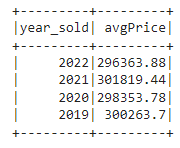
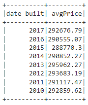
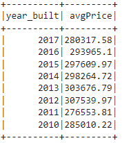
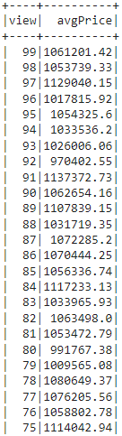

# Home_Sales
Module 22 Challenge - DUE 6th May 2024

Home Sales Key Metrics
   
# The required questions answered as follows:

1- What is the average price for a four-bedroom house sold for each year? Round off your answer to two decimal places.
    The average prices for a four bedroom
    house sold by year are as follows:

   

2- What is the average price of a home for each year it was built that has three bedrooms and three bathrooms? Round off your answer to two decimal places.

   

3- What is the average price of a home for each year that has three bedrooms, three bathrooms, two floors, and is greater than or equal to 2,000 square feet? Round off your answer to two decimal places.

   

4- What is the "view" rating for homes costing more than or equal to $350,000? Determine the run time for this query, and round off your answer to two decimal places.

   

   Runtime: --- 0.6633007526397705 seconds ---

Compare the run times for the various methods of running the same sql query as question # 4 above:

   Runtime after cache: --- 0.652350902557373 seconds ---

   Runtime after partioning: --- 0.9011518955230713 seconds ---

